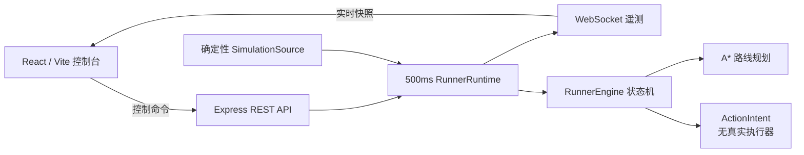

# Shadow Runner Lab

一个运行在本机的固定路线智能体 Web Demo，用于演示：模拟观测、A* 路线规划、状态机决策、卡住恢复、REST/WebSocket 遥测和人工控制。

> [!IMPORTANT]
> 本项目只连接内置模拟器、离线回放或 mock 数据。它不会读取在线游戏进程，不会采集游戏画面，不会发送真实键鼠输入，也不包含反作弊绕过能力。

## 1. 能看到什么

启动后，浏览器会显示一个实时仿真控制台：

- 从模拟出生点到撤离点的最低代价路线；
- 当前节点、下一目标、定位置信度和路线进度；
- `idle → localizing → navigating → recovering → extracted` 状态变化；
- 启动、暂停、继续、重置和注入卡住控制；
- 通过 WebSocket 实时更新的事件时间线；
- CPU-only、无输入执行器的运行边界。

默认场景使用确定性路线，运行一次通常只需要约 2～3 秒，便于快速观察完整闭环。

## 2. 环境要求

必需：

- Windows 10/11、macOS 或 Linux；
- [Node.js](https://nodejs.org/) 24 或更高版本；
- npm（随 Node.js 安装）；
- Git。

检查版本：

```bash
node --version
npm --version
git --version
```

`node --version` 应显示 `v24.x.x` 或更高版本。

## 3. 五分钟启动 Demo

### 3.1 获取代码

```bash
git clone https://github.com/Lvjinhong/delta-shadow-runner.git
cd delta-shadow-runner
```

### 3.2 Windows：推荐入口

在 PowerShell 或 Windows Terminal 中运行：

```powershell
powershell.exe -NoProfile -ExecutionPolicy Bypass -File .\init.ps1 -Mode dev
```

脚本会：

1. 检查 Node.js 版本；
2. 根据 `package-lock.json` 判断依赖是否完整；
3. 首次运行或依赖漂移时执行 `npm ci`；
4. 同时启动 API/WebSocket 服务和 Vite Web 开发服务器。

看到两个服务都启动后，打开：

<http://localhost:5173>

停止服务：回到终端按 `Ctrl+C`。

`-ExecutionPolicy Bypass` 只对本次 PowerShell 进程生效，不会修改系统的持久执行策略。

### 3.3 macOS / Linux

```bash
npm ci
npm run dev
```

然后打开：

<http://localhost:5173>

停止服务：回到终端按 `Ctrl+C`。

## 4. 操作教程

页面显示“遥测在线”和“待机”后，按下面顺序操作：

1. 点击“启动 / 继续”。任务会进入“定位中”，随后开始沿固定路线航行。
2. 如果要演示暂停，立即点击“暂停任务”；再次点击“启动 / 继续”即可恢复。
3. 在任务撤离前点击“注入卡住”。下一次 500ms tick 会进入“脱困中”，恢复次数增加为 `1`。
4. 查看“运行事件”区域。即使“脱困中”状态很短，事件中仍会保留“检测到卡住，执行回退恢复”。
5. 等待任务显示“已撤离”，此时路线进度应为 `100%`，当前位置和目标均为 `EXTRACT`。
6. 点击“重置模拟”，页面回到 `SPAWN A`、`0%` 路线进度和“待机”状态。

因为默认路线只运行几秒，如果“注入卡住”已经禁用，通常表示任务已经撤离。点击“重置模拟”，重新启动后尽快注入即可。

### 控制能力

| 控制 | 可用条件 | 效果 |
| --- | --- | --- |
| 启动 / 继续 | 待机或人工暂停 | 启动新任务，或恢复被暂停的任务 |
| 暂停任务 | 定位、航行或恢复中 | 保存可恢复状态并停止推进 |
| 重置模拟 | 任意状态 | 重置模拟源、状态、指标和事件 |
| 注入卡住 | 定位、航行或恢复中 | 让下一次模拟观测进入恢复分支 |

## 5. Production 模式

Production 模式会先构建服务端和 Web 静态资源，再由同一个 Node.js 服务提供页面、REST API 和 WebSocket。

### Windows

```powershell
powershell.exe -NoProfile -ExecutionPolicy Bypass -File .\init.ps1 -Mode build
powershell.exe -NoProfile -ExecutionPolicy Bypass -File .\init.ps1 -Mode start
```

### macOS / Linux

```bash
npm ci
npm run build
npm start
```

打开：

<http://127.0.0.1:4173>

默认配置：

| 配置 | 默认值 | 说明 |
| --- | --- | --- |
| `HOST` | `127.0.0.1` | Production 服务监听地址 |
| `PORT` | `4173` | Production 服务端口 |
| Runtime tick | `500ms` | 模拟观测和状态推进间隔 |
| 计算设备 | CPU-only | 没有 GPU 运行时依赖 |

macOS/Linux 自定义示例：

```bash
HOST=127.0.0.1 PORT=8080 npm start
```

PowerShell 自定义示例：

```powershell
$env:HOST = "127.0.0.1"
$env:PORT = "8080"
npm.cmd start
```

然后访问 `http://127.0.0.1:8080`。

> [!NOTE]
> 开发模式的 Vite 代理固定连接 `127.0.0.1:4173`，因此开发模式建议保留默认 API 端口。`HOST`/`PORT` 自定义主要用于 Production 模式。

## 6. API 使用

所有 REST 响应都使用统一 envelope：

```json
{
  "success": true,
  "data": {},
  "error": null
}
```

### REST API

| 方法 | 路径 | 说明 |
| --- | --- | --- |
| `GET` | `/api/health` | 服务状态、运行模式和 tick 间隔 |
| `GET` | `/api/snapshot` | 当前快照、场景地图和控制能力 |
| `POST` | `/api/control/start` | 启动或继续任务 |
| `POST` | `/api/control/pause` | 暂停任务 |
| `POST` | `/api/control/reset` | 重置模拟 |
| `POST` | `/api/control/inject-stuck` | 为下一次 tick 注入卡住观测 |

控制请求只接受空 JSON 对象 `{}`。未知命令、非空请求体或非法路径返回 HTTP `400`。

macOS/Linux 示例：

```bash
curl http://127.0.0.1:4173/api/health
curl http://127.0.0.1:4173/api/snapshot
curl -X POST http://127.0.0.1:4173/api/control/start \
  -H 'Content-Type: application/json' \
  -d '{}'
curl -X POST http://127.0.0.1:4173/api/control/inject-stuck \
  -H 'Content-Type: application/json' \
  -d '{}'
```

PowerShell 示例：

```powershell
Invoke-RestMethod -Uri "http://127.0.0.1:4173/api/health"
Invoke-RestMethod -Uri "http://127.0.0.1:4173/api/snapshot"
Invoke-RestMethod -Method Post `
  -Uri "http://127.0.0.1:4173/api/control/start" `
  -ContentType "application/json" `
  -Body "{}"
```

健康检查成功示例：

```json
{
  "success": true,
  "data": {
    "status": "ok",
    "mode": "simulation",
    "compute": "cpu-only",
    "tickMs": 500,
    "running": true
  },
  "error": null
}
```

### WebSocket

连接地址：

```text
ws://127.0.0.1:4173/ws
```

服务端连接成功后首先发送：

```json
{
  "type": "connection",
  "data": {
    "status": "connected",
    "mode": "simulation"
  }
}
```

随后发送 `snapshot` 消息，并在控制命令或运行时 tick 后继续广播最新快照：

```json
{
  "type": "snapshot",
  "data": {
    "snapshot": {},
    "scenario": {},
    "capabilities": {}
  }
}
```

## 7. 架构



核心分层：

- `src/core`：纯 TypeScript 路线规划、场景、状态机和类型；
- `src/server`：运行时循环、REST、WebSocket 和生命周期；
- `src/web`：快照展示和控制请求，不包含决策逻辑；
- `tests`：核心、服务端、Web 协议、样式、Windows 启动脚本和浏览器 E2E。

## 8. 项目结构

```text
.
├── init.ps1                 # Windows 安装、启动、测试和构建入口
├── package.json             # npm 依赖和统一脚本
├── playwright.config.ts     # Chromium E2E 配置
├── src/
│   ├── core/                # A*、固定场景、状态机和公共类型
│   ├── server/              # Express、WebSocket 和 RunnerRuntime
│   └── web/                 # React/Vite 控制台
├── tests/
│   ├── core/                # 路线和状态机测试
│   ├── server/              # REST/WebSocket 测试
│   ├── web/                 # Web 协议、投影和样式测试
│   └── e2e/                 # Playwright 真实浏览器流程
├── docs/superpowers/        # 设计说明和实现计划
├── feature-list.json        # 已验收功能和证据
└── Codex-progress.txt       # Windows 检查点与恢复说明
```

## 9. 测试和质量检查

### 单元与集成测试

```bash
npm test
```

当前测试覆盖路线规划、状态机、恢复分支、API、WebSocket、前端协议校验、响应式样式和 Windows 初始化脚本。

### 类型检查和构建

```bash
npm run typecheck
npm run build
```

### 浏览器 E2E

首次运行先安装 Chromium：

```bash
npx playwright install chromium
```

Windows 也可以显式调用 `.cmd`：

```powershell
npx.cmd playwright install chromium
```

执行 E2E：

```bash
npm run test:e2e
```

E2E 会自动构建 production bundle、启动 `127.0.0.1:4173`、运行单 worker Chromium 测试并关闭服务。它覆盖：

- 启动、暂停、继续、卡住恢复、撤离和重置；
- 真实 REST 与 WebSocket；
- `1440×900`、`1024×768`、`390×844` 三档布局；
- 横向溢出、关键 ARIA、44px 控件和 reduced motion；
- console error、page error、失败请求和错误响应。

测试产物：

| 产物 | 路径 |
| --- | --- |
| HTML 报告 | `playwright-report/index.html` |
| JUnit | `test-results/e2e-junit.xml` |
| 截图、失败视频和 trace | `test-results/artifacts/` |

Windows 一键测试/构建：

```powershell
powershell.exe -NoProfile -ExecutionPolicy Bypass -File .\init.ps1 -Mode test
powershell.exe -NoProfile -ExecutionPolicy Bypass -File .\init.ps1 -Mode build
```

强制重新安装 npm 依赖：

```powershell
powershell.exe -NoProfile -ExecutionPolicy Bypass -File .\init.ps1 -Mode test -ForceInstall
```

## 10. 常见问题

### 提示“未找到 Node.js”或版本低于 24

安装 Node.js 24+，关闭并重新打开终端，再检查：

```powershell
node --version
npm.cmd --version
```

### PowerShell 阻止运行 `init.ps1`

不要修改全局 ExecutionPolicy，直接使用 README 中的 process-only 命令：

```powershell
powershell.exe -NoProfile -ExecutionPolicy Bypass -File .\init.ps1 -Mode dev
```

### `4173` 或 `5173` 端口被占用

Windows：

```powershell
Get-NetTCPConnection -LocalPort 4173,5173 -State Listen -ErrorAction SilentlyContinue
```

macOS/Linux：

```bash
lsof -nP -iTCP:4173 -sTCP:LISTEN
lsof -nP -iTCP:5173 -sTCP:LISTEN
```

停止占用端口的本项目旧进程，或在 Production 模式下通过 `PORT` 更换端口。不要在未确认进程归属时强制结束其他程序。

### 依赖目录存在但启动仍报缺包

Windows 使用：

```powershell
powershell.exe -NoProfile -ExecutionPolicy Bypass -File .\init.ps1 -Mode test -ForceInstall
```

macOS/Linux 使用：

```bash
npm ci
```

### Playwright 提示找不到浏览器

```bash
npx playwright install chromium
npm run test:e2e
```

### 页面一直显示“遥测连接中”

1. 确认开发模式终端中 `server` 和 `web` 两个进程都已启动；
2. 确认访问开发地址 `http://localhost:5173`，不是其他端口；
3. 请求 `http://127.0.0.1:4173/api/health`；
4. 检查端口是否被旧进程占用；
5. 查看浏览器控制台和终端中的具体错误。

## 11. 当前限制

- 默认只有一个内置固定场景和确定性模拟源；
- 运行状态保存在进程内，重启服务后不会持久化；
- 当前没有用户认证或多租户隔离；
- 默认只在 localhost 使用，未按公网服务做安全加固；
- E2E 当前只验证 Chromium；
- 项目不包含真实游戏视觉识别、输入执行器或线上游戏集成，因此测试结果不能解释为正式游戏环境的成功率、准确率或安全性结论。

如需扩展新场景，优先实现 `RunnerScenario` 和 `SimulationSource`，保持 `src/core` 与真实输入设备解耦。

## 12. 开发约定

提交前至少运行：

```bash
npm test
npm run build
npm run test:e2e
```

提交格式：

```text
<type>: <description>
```

其中 `type` 使用 `feat`、`fix`、`refactor`、`docs`、`test`、`chore`、`perf` 或 `ci`。

更完整的设计和实现背景见：

- [`docs/superpowers/specs/2026-07-14-shadow-runner-design.md`](docs/superpowers/specs/2026-07-14-shadow-runner-design.md)
- [`docs/superpowers/plans/2026-07-14-shadow-runner-implementation.md`](docs/superpowers/plans/2026-07-14-shadow-runner-implementation.md)
